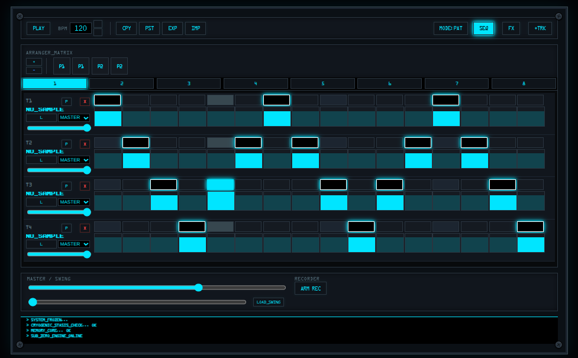

<h1 align="center">Web Audio Engineering and Interface Design</h1>

  

  

<h2>What is this?</h2>

  The MEGAMICRO suite is a collection of simple, no-nonsense web apps for making music. They are built specifically for <strong>ChromeOS</strong> and modern browsers to be lightweight, fast, and easy to use. No big setups, just tools that work.

<h3>The Project List</h3>
<h2>Workstations</h2>
  <ul>
    <li>
      <a class="project-link" href="https://alphaslider.github.io/megamicrodaw/">Mega Micro DAW</a> 
      (47 KB)
      A lightweight beat-making environment featuring a traditional mixer architecture with FX strips, generative pattern tools, and support for 32 steps across 8 banks.
    </li>
    <li>
      <a class="project-link" href="https://alphaslider.github.io/BapStep8/">BapStep8</a>
      A lean 16-step sampler and sequencer built for a boom-bap workflow. Includes dedicated FX slots per track and mono-trigger logic for clean sample layering.
    </li>
  </ul>

  <h2>Utilities</h2>
  <ul>
    <li>
      <a class="project-link" href="https://alphaslider.github.io/SP224-Pitch-shifter/">SP-224 Pitch Shifter</a>
      Focused pitch-corrected time stretching. Inspired by the grit and workflow of the Zoom ST-224 and Boss SP-202 hardware units.
    </li>
    <li>
      <a class="project-link" href="https://alphaslider.github.io/HTML5SAMPLER/">HTML5 Tab Sampler</a>
      Capture audio directly from a browser tab. Features four quality grades (from lo-fi to clean) with instant export.
    </li>
    <li>
      <a class="project-link" href="https://alphaslider.github.io/LazerBlade3/">Lazer Blade Wave Edit</a>
      A precise tool for visualizing and trimming audio loops via a zoomable canvas interface.
    </li>
    <li>
      <a class="project-link" href="https://alphaslider.github.io/slicer/">S.L.I.C.E.R</a>
      A linear interface for setting slice points and exporting chops as individual files or a ZIP archive.
    </li>
  </ul>

  <h2>SP404 tribute Plugins for megamicro</h2>

<a href="https://github.com/alphaslider/megamicrodaw/tree/main/plugins">Plugin Repository Source</a>

<ul>
  <li>3bandisolator.js – Three-band frequency splitter for isolation.</li>
  <li>LofiComp.js – Character-driven compression and saturation.</li>
  <li>Tape_Echo.js – Vintage feedback and tape loop simulation.</li>
  <li>Vinyl_Sim.js – Surface noise and turntable pitch flutter.</li>
  <li>DJFXLooper.js – Real-time beat repeats and performance rolls.</li>
  <li>Grossglitch.js – Buffer chopping and rhythmic re-ordering.</li>
  <li>Drumsynth.js – Minimalist engine for synthetic percussion.</li>
  <li>Voicetoskull.js – Experimental resonant filtering and modulation.</li>
  <li>Meter2.js – Visual signal analysis and peak monitoring.</li>
</ul>
<h2>Bapstep8 plugins</h2>
<h2>Groove & Swing Engines</h2>
<ul>
  <li><a href="https://github.com/alphaslider/Omikuji/blob/main/plugins/DillaSwing.js">DillaSwing.js</a> – Adds humanized, unquantized "swing" timing to sequencer patterns.</li>
  <li><a href="https://github.com/alphaslider/Omikuji/blob/main/plugins/MPC%20Groove%20js.js">MPC Groove js.js</a> – Replicates the classic hardware sequencer timing and shuffle.</li>
  <li><a href="https://github.com/alphaslider/Omikuji/blob/main/plugins/Volcasample_swing.js">Volcasample_swing.js</a> – Emulates the specific rhythmic lilt of portable hardware samplers.</li>
</ul>

<h2>Synthesizers & Tone Generators</h2>
<ul>
  <li><a href="https://github.com/alphaslider/Omikuji/blob/main/plugins/kicksynth.js">kicksynth.js</a> – Sub-heavy bass drum generator built with pure oscillators.</li>
  <li><a href="https://github.com/alphaslider/Omikuji/blob/main/plugins/snaresynth.js">snaresynth.js</a> – Generative snare engine using noise and filtered transients.</li>
  <li><a href="https://github.com/alphaslider/Omikuji/blob/main/plugins/hat.js">hat.js</a> – High-frequency synthesis for hi-hats and metallic percussion.</li>
  <li><a href="https://github.com/alphaslider/Omikuji/blob/main/plugins/pluck.js">pluck.js</a> – Karplus-Strong or physical modeling style string synthesis.</li>
  <li><a href="https://github.com/alphaslider/Omikuji/blob/main/plugins/bell.js">bell.js</a> – Metallic, FM-style percussive bell tones.</li>
  <li><a href="https://github.com/alphaslider/Omikuji/blob/main/plugins/beep.js">beep.js</a> – Simple, clean sine/square wave utility oscillator.</li>
</ul>

<h2>DSP Effects</h2>
<ul>
  <li><a href="https://github.com/alphaslider/Omikuji/blob/main/plugins/BitCrusher.js">BitCrusher.js</a> – Digital distortion via sample rate reduction and bit-depth clipping.</li>
  <li><a href="https://github.com/alphaslider/Omikuji/blob/main/plugins/LushReverbPlugin.js">LushReverbPlugin.js</a> – A more dense, atmospheric spatial processor.</li>
  <li><a href="https://github.com/alphaslider/Omikuji/blob/main/plugins/phaser.js">phaser.js</a> – Multi-stage phase shifting for sweeping, psychedelic textures.</li>
  <li><a href="https://github.com/alphaslider/Omikuji/blob/main/plugins/chorus.js">chorus.js</a> – Delay-line based modulation for width and detuning.</li>
  <li><a href="https://github.com/alphaslider/Omikuji/blob/main/plugins/isolator3.js">isolator3.js</a> – Specialized 3-band frequency isolation tool.</li>
  <li><a href="https://github.com/alphaslider/Omikuji/blob/main/plugins/master.js">master.js</a> – Final stage signal processing and limiting for the master bus.</li>
</ul>

<h2>Experimental Tools</h2>
<ul>
  <li><a href="https://github.com/alphaslider/Omikuji/blob/main/plugins/raveslicer2.html">raveslicer2.html</a> – A standalone HTML utility for rhythmic breakbeat chopping.</li>
</ul>

<h2>How it works</h2>

The focus here is on <strong>Vanilla JS</strong> and <strong>HTML5</strong>. By avoiding heavy frameworks, these tools stay fast and won't break when the next big update rolls around.

<table width="100%">
  <thead>
    <tr>
      <th align="left">Core</th>
      <th align="left">Markup</th>
      <th align="left">Logic</th>
      <th align="left">Sound</th>
    </tr>
  </thead>
  <tbody>
    <tr>
      <td></td>
      <td></td>
      <td></td>
      <td><strong>Web Audio API</strong></td>
    </tr>
  </tbody>
</table>

<h2>Design Choices</h2>
<ul>
  <li><strong>Mono Triggering:</strong> Track cells and samples trigger one at a time. No overlapping, no messy phase issues—just a clean, single signal per track.</li>
  <li><strong>Integrated Mixer:</strong> Includes a built-in mixer and FX loader so you can shape the sound as you go.</li>
  <li><strong>Portable Projects:</strong> The <code>.daw</code> format saves everything (samples and settings) into one file for 100% session recall.</li>
  <li><strong>Zero Dependencies:</strong> Pure code. No external libraries to load or manage.</li>
</ul>

  
Build Status: Ready to Play | Last Sync: 2026.02.07

