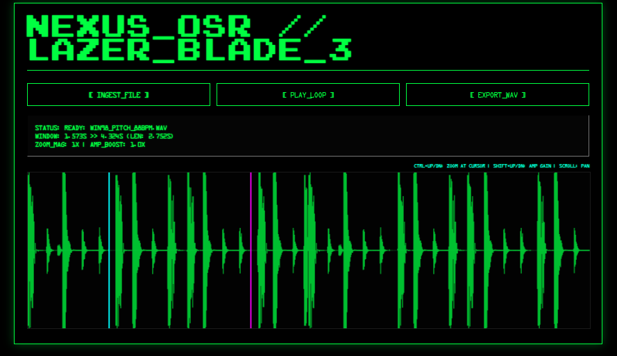

<h1 align="center">Web Audio Engineering and Interface Design</h1>

  

  

<h2>What is this?</h2>

  The MEGAMICRO suite is a collection of simple, no-nonsense web apps for making music. They are built specifically for <strong>ChromeOS</strong> and modern browsers to be lightweight, fast, and easy to use. No big setups, just tools that work.

<h3>The Project List</h3>
<ul>
  <li><strong><a href="https://alphaslider.github.io/megamicrodaw/">Mega Micro DAW</a></strong> – A small-scale workstation for arranging tracks and samples.</li>
  <li><strong><a href="https://alphaslider.github.io/Omikuji/">Omikuji 3</a></strong> – A random pattern generator for when you need a new spark.</li>
  <li><strong><a href="https://alphaslider.github.io/SP224-Pitch-shifter/">SP-224 Pitch Shifter</a></strong> – A straightforward utility for time-stretching and shifting pitch.</li>
  <li><strong><a href="https://alphaslider.github.io/HTML5SAMPLER/">HTML5 Tab Sampler</a></strong> – A quick-access sampler that lives in your browser tab.</li>
  <li><strong><a href="https://alphaslider.github.io/LazerBlade3/">Lazer Blade Wave Edit</a></strong> – A simple tool for visualizing and trimming your audio files.</li>
  <li><strong><a href="https://alphaslider.github.io/slicer/">S.L.I.C.E.R</a></strong> – A linear interface for chopping up sounds and rendering them out.</li>
</ul>

<h2>How it works</h2>

The focus here is on <strong>Vanilla JS</strong> and <strong>HTML5</strong>. By avoiding heavy frameworks, these tools stay fast and won't break when the next big update rolls around.

<table width="100%">
  <thead>
    <tr>
      <th align="left">Core</th>
      <th align="left">Markup</th>
      <th align="left">Logic</th>
      <th align="left">Sound</th>
    </tr>
  </thead>
  <tbody>
    <tr>
      <td></td>
      <td></td>
      <td></td>
      <td><strong>Web Audio API</strong></td>
    </tr>
  </tbody>
</table>

<h2>Design Choices</h2>
<ul>
  <li><strong>Mono Triggering:</strong> Track cells and samples trigger one at a time. No overlapping, no messy phase issues—just a clean, single signal per track.</li>
  <li><strong>Integrated Mixer:</strong> Includes a built-in mixer and FX loader so you can shape the sound as you go.</li>
  <li><strong>Portable Projects:</strong> The <code>.daw</code> format saves everything (samples and settings) into one file for 100% session recall.</li>
  <li><strong>Zero Dependencies:</strong> Pure code. No external libraries to load or manage.</li>
</ul>

  
Build Status: Ready to Play | Last Sync: 2026.02.07

