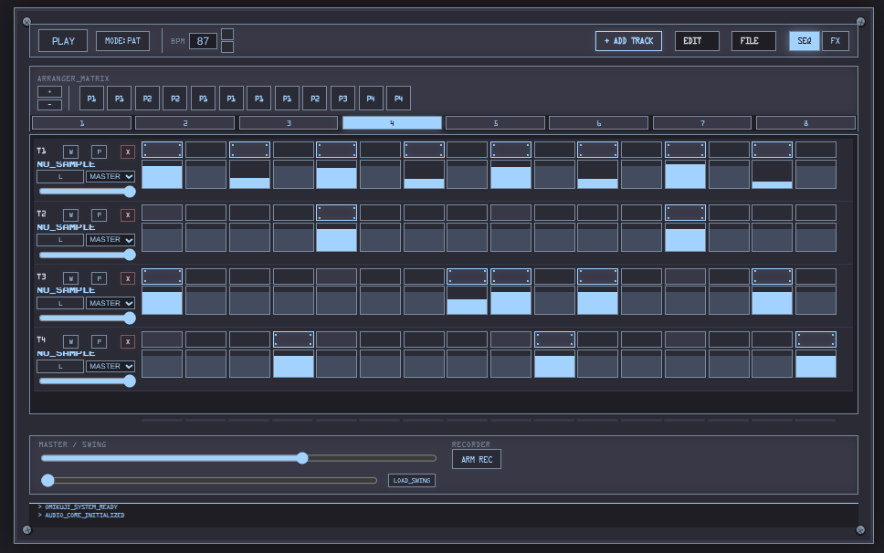

<!DOCTYPE html>
<html lang="en">
<head>
    <meta charset="UTF-8">
    <title>Web Audio Engineering and Interface Design</title>
</head>
<body>

<h1 align="center">Web Audio Engineering and Interface Design</h1>

    

<h2>Overview</h2>

    The <strong>MEGAMICRO</strong> suite is a collection of high-performance, browser-native audio applications. Engineered for ChromeOS and modern web environments, these tools prioritize low-latency signal processing, minimal memory overhead, and a "zero-dependency" philosophy to ensure session longevity and performance stability.

<h2>Production Workstations</h2>

    
Core Sequencing Environments

    <ul>
        <li><a href="https://alphaslider.github.io/Four-Track-Web-Audio-Groove-Box-/">AZ505 Four Track</a>: A high-fidelity, 4-track groove box designed for rapid loop-based composition. [HTML5/Vanilla JS]</li>
        <li><a href="https://alphaslider.github.io/nexus/">Nexus</a>: A dedicated groove box and sampler interface.</li>
        <li><a href="https://alphaslider.github.io/megamicrodaw/">Mega Micro DAW</a>: A comprehensive (47 KB) beat-making environment. Features a traditional mixer architecture with FX strips, generative pattern sequencing, and 8-bank support for complex arrangements.</li>
        <li><a href="https://alphaslider.github.io/BapStep8/">BapStep8</a>: A specialized 16-step sampler sequencer optimized for boom-bap production, featuring mono-trigger logic for surgical sample layering.</li>
    </ul>

    
System Navigation

    <ul>
        <li><a href="https://alphaslider.github.io/Stasis/">Grand Unified Console</a>: A centralized dashboard for launching and managing web utilities via iframe integration and dynamic menus.</li>
    </ul>

<h2>Audio Utilities</h2>

    
Processing & Conversion

    <ul>
        <li><a href="https://alphaslider.github.io/wavetomp3/">Wav To Mp3 Converter</a>: High-bitrate transcoding engine utilizing psychoacoustic modeling for professional-grade audio fidelity.</li>
        <li><a href="https://alphaslider.github.io/samplecommannder/">Sample Commander</a>: Optimized asset management utilizing virtualized lists for instant navigation of large sample libraries.</li>
    </ul>

    
Editing & Sampling

    <ul>
        <li><a href="https://alphaslider.github.io/SP224-Pitch-shifter/">SP-224 Pitch Shifter</a>: DSP-focused time-stretching inspired by classic hardware-level grit and aliasing.</li>
        <li><a href="https://alphaslider.github.io/HTML5SAMPLER/">HTML5 Tab Sampler</a>: Browser-based audio capture with multi-grade quality settings for rapid sampling workflows.</li>
        <li><a href="https://alphaslider.github.io/LazerBlade3/">Lazer Blade Wave Edit</a>: Precision waveform trimming via a zoomable canvas interface.</li>
        <li><a href="https://alphaslider.github.io/slicer/">S.L.I.C.E.R</a>: A linear interface for non-destructive slice-point mapping and batch export.</li>
    </ul>

<h2>Plugin Architecture</h2>

    
DSP Effects & Sound Design

    
<a href="https://github.com/alphaslider/megamicrodaw/tree/main/plugins">Plugin Repository Source</a>

    <ul>
        <li><strong>Character Effects:</strong> LofiComp.js (saturation), Vinyl_Sim.js (turntable artifacts), BitCrusher.js (sample rate/bit-depth reduction).</li>
        <li><strong>Spatial & Texture:</strong> LushReverbPlugin.js (atmospheric processing), Tape_Echo.js (feedback delay), phaser.js, and chorus.js.</li>
        <li><strong>Utility & Performance:</strong> DJFXLooper.js (real-time performance), Grossglitch.js (buffer re-ordering), and isolator3.js (3-band frequency splitting).</li>
    </ul>

    
Synthesis & Swing Engines

    <ul>
        <li><strong>Generative Engines:</strong> kicksynth.js, snaresynth.js, hat.js, pluck.js (physical modeling), and bell.js (FM synthesis).</li>
        <li><strong>Timing/Groove:</strong> DillaSwing.js, MPC Groove js.js, and Volcasample_swing.js (replicating classic hardware lilt and humanization).</li>
    </ul>

<h2>Technical Foundation</h2>

    By utilizing the <strong>Web Audio API</strong> with vanilla JavaScript, these tools remain lightweight and framework-independent. The design focuses on <strong>Mono-Triggering</strong> for phase-perfect playback and <strong>Portable .daw formats</strong> for session recall.

<table width="100%">
    <tr>
        <th>Core</th><th>Markup</th><th>Logic</th><th>Sound</th>
    </tr>
    <tr>
        <td>HTML5</td><td>CSS3</td><td>Vanilla JS</td><td>Web Audio API</td>
    </tr>
</table>

    
Build Status: Ready to Play | Last Sync: 2026.07.08

</body>
</html>
